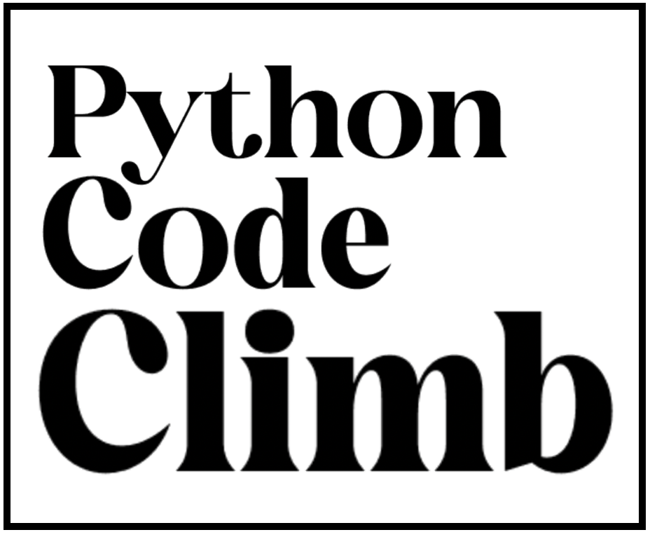

# Python Code Climb

Welcome to Python Code Climb, a learning-oriented repository designed to help you navigate through the intricacies of Python programming. This repository is structured around a series of questions covering various Python topics. Each question is not only a challenge but an opportunity to learn. Accompanying each question is a detailed answer and a reference to specific learning materials within the repository for further exploration.

## Objective

Our objective is to provide a comprehensive learning experience that encourages self-paced study and hands-on practice. Whether you're a beginner looking to understand the basics or an intermediate developer aiming to solidify your understanding of more complex concepts, Python Code Climb is here to guide your learning journey.

## How It Works

- **Questions:** Each folder within the repository represents a different Python topic, ranging from basic syntax to more advanced concepts like asynchronous programming and design patterns.
- **Answers:** Alongside each question, you'll find an `answer` section that not only provides the solution but also explains the rationale behind it.
- **Learning Materials:** If a question proves challenging, a `learn more` note will direct you to specific materials within the repository, such as tutorials, guides, and documentation, to deepen your understanding of the concept.

## Work in Progress

This project is continuously evolving, with new questions, answers, and learning materials being added regularly. 

Your contributions and feedback are highly valued as we work together to make Python Code Climb a rich and supportive learning resource.

## Contributing

We welcome contributions of all kinds, from questions and answers to additional learning materials and suggestions for improvement. Please see our `CONTRIBUTING.md` file for more information on how to get involved.

## License

This project is licensed under the [MIT License](LICENSE.md) - see the file for details.

## Acknowledgments

- Python community for continuous inspiration and support.
- All contributors who have helped to expand and improve this repository.

Thank you for joining us on this journey up the Python Code Climb. Happy learning!
